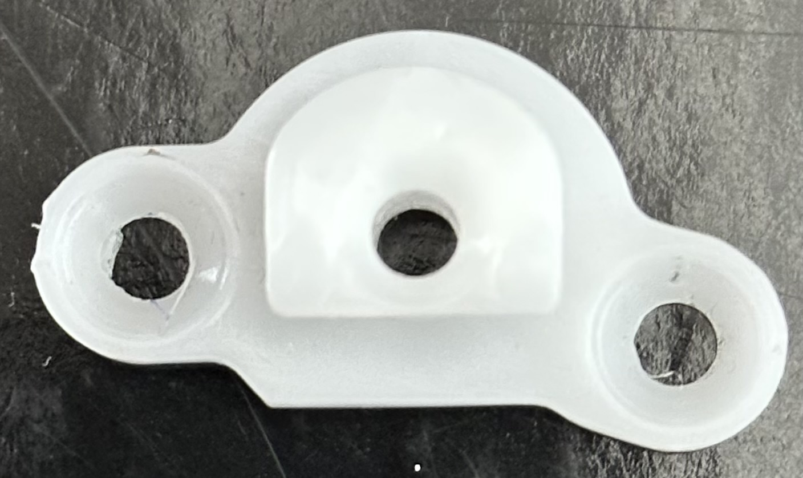
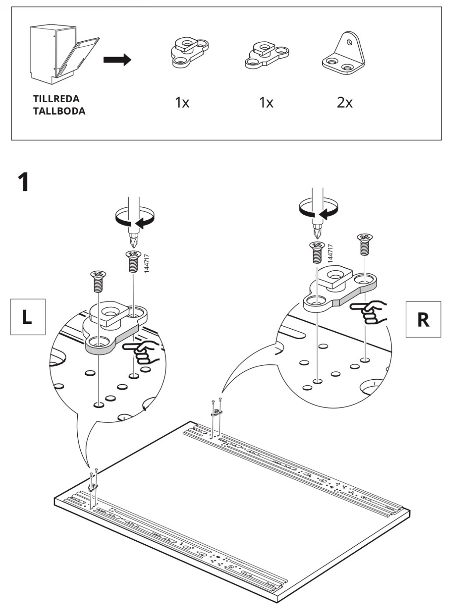
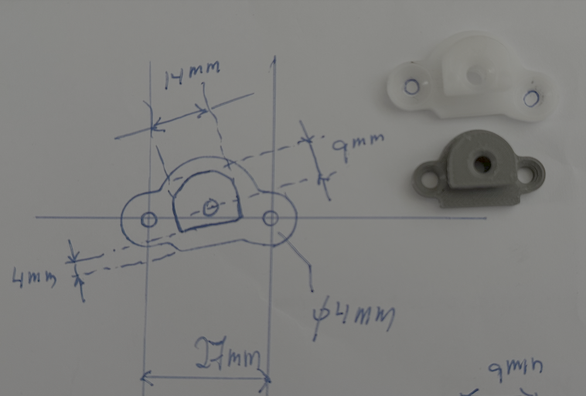
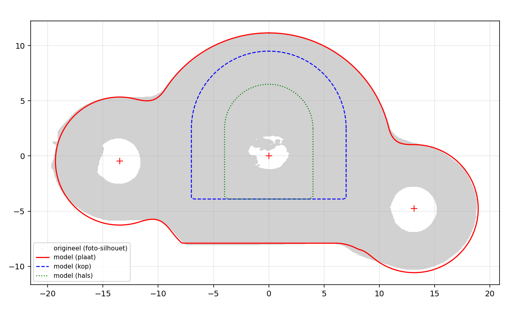

# IKEA tillreda dishwasher

This is one of the two items. They are mirrored as can been seen in the created STL files.

The parts are described in this page of the manual.

So, this was the sketch used as input for Claude AI. An earlier try shows a version to small and not asymetrical.

After tweaking a bit the end result is verified.

# STL files

# FreeCad

FreeCad is a 3D drawing program. It is possible to define python scripts which is called a macro. The script to generate both parts is [here](bracket_freecad_macro.py).
